# DB-Coursework-2026-2

Repositorio de entrega para la asignatura de Bases de Datos (semestre 2026-2).

## Instrucciones de entrega — Fork y Pull Request

Cada estudiante debe integrar su proyecto a este repositorio mediante un Pull Request (PR) desde su fork. Sigue este procedimiento y el formato de ejemplo: https://github.com/gabrielhuav/DB-Coursework-2026-1

Pasos rápidos para enviar tu PR:

1. Haz fork de este repositorio a tu cuenta de GitHub.
2. Clona tu fork localmente:

```bash
git clone https://github.com/<tu-usuario>/DB-Coursework-2026-2.git
cd DB-Coursework-2026-2
```

3. Modifica el `README.md` y


4. Haz commit y push a tu fork (usa `main` o una rama propia):

```bash
git add <tu-usuario>
git commit -m "Add project for <tu-usuario>"
git push origin main
```

6. Abre un Pull Request desde tu fork hacia `gabrielhuav/DB-Coursework-2026-2` (base: `main`).

## Proyecto 1: Booksnexus (Red social de libros)
Plataforma web tipo red social enfocada en lectores, donde los usuarios pueden registrarse, compartir reseñas, publicar opiniones sobre libros, seguir a otros usuarios y descubrir nuevas lecturas mediante interacción social.

### 🛠️ Tecnologías
* *Backend:* Node.js con Express.js
* *Base de Datos:* PostgreSQL (Supabase)
* *Frontend:* HTML, CSS y JavaScript vanilla (Fetch API)
* *Despliegue:* Render y GitHub pages

<details>
<summary>🖼️ Ver capturas de pantalla</summary>

| | |
|---|---|
|  | |
|  |  |
|  | |
</details>

### ✨ Funcionalidades principales
* Registro e inicio de sesión de usuarios
* Publicación de reseñas y opiniones de libros
* Sistema de seguidores y seguidos
* Timeline con publicaciones de usuarios seguidos
* Gestión de libros favoritos
* Persistencia de datos mediante PostgreSQL
* API REST para comunicación entre frontend y backend

### 🔗 Enlaces
Código Fuente Backend: [Repositorio Backend](https://github.com/Diegocstln/booksnexus-back)
Código Fuente Frontend: [Repositorio Frontend](https://github.com/Diegocstln/mi-proyecto-bd)
Demo en Vivo: [Booksnexus Web](https://diegocstln.github.io/mi-proyecto-bd/)


## Proyecto Huellitas

Huellitas es una fundación enfocada en brindar un hogar y mejores oportunidades a animales en situación de abandono. Con el desarrollo de una página web, se mejoró significativamente la presencia digital de la fundación, ya que anteriormente únicamente operaba de manera presencial y sin publicidad en línea.

Para solucionar este problema, se desarrolló una plataforma web conectada a una base de datos que almacena la información completa de todos los animales disponibles en el refugio. Además, se implementó un apartado de donaciones que permite apoyar económicamente a la fundación, ayudando a convertir a Huellitas en un mejor refugio y hogar temporal para los animales.

### Tecnologías utilizadas

* Javascript
* PostgreSQL
* CSS
* GitHub

### Capturas del proyecto

| | |
|---|---|
| 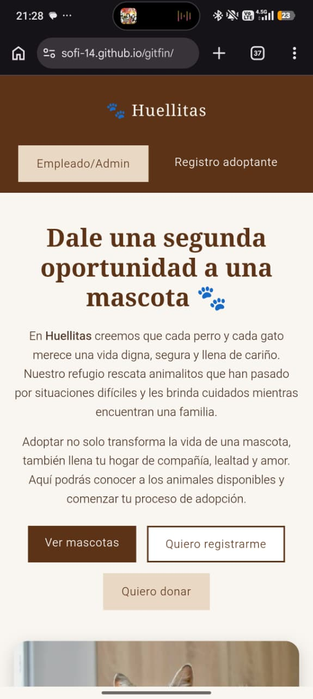 | 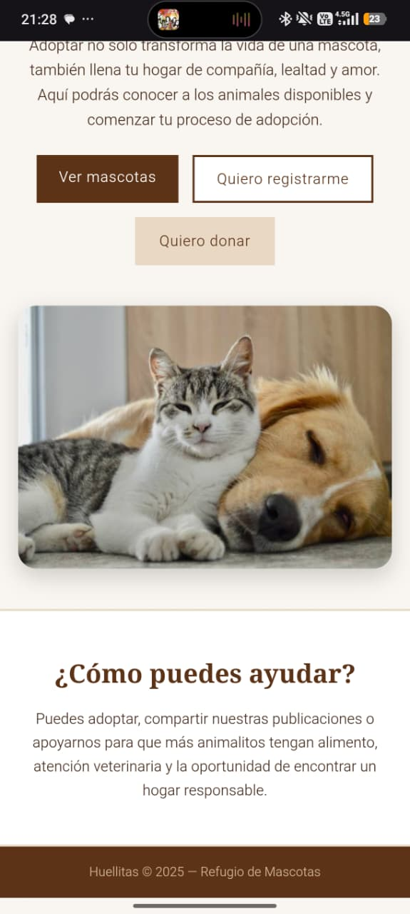 |
| 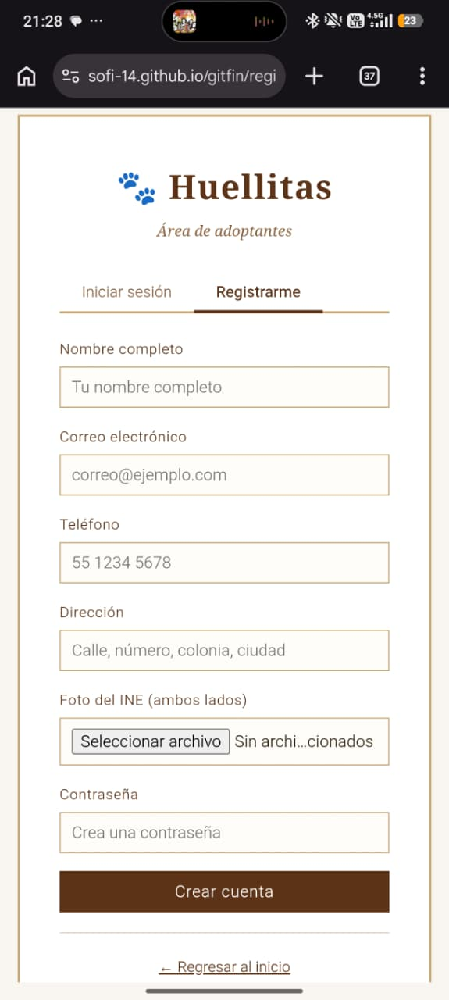 | 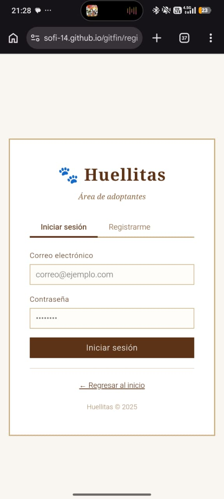 |
| 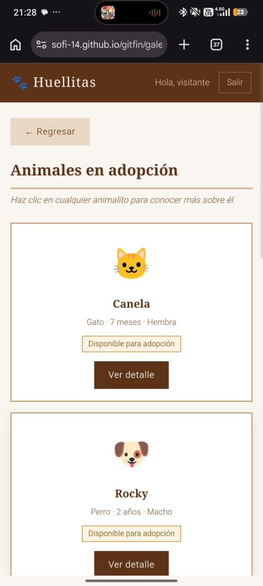 | 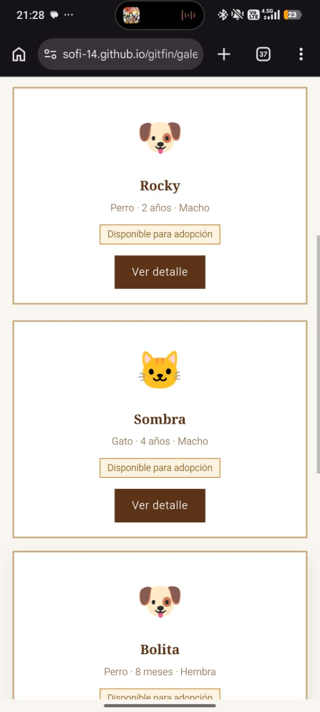 |
| 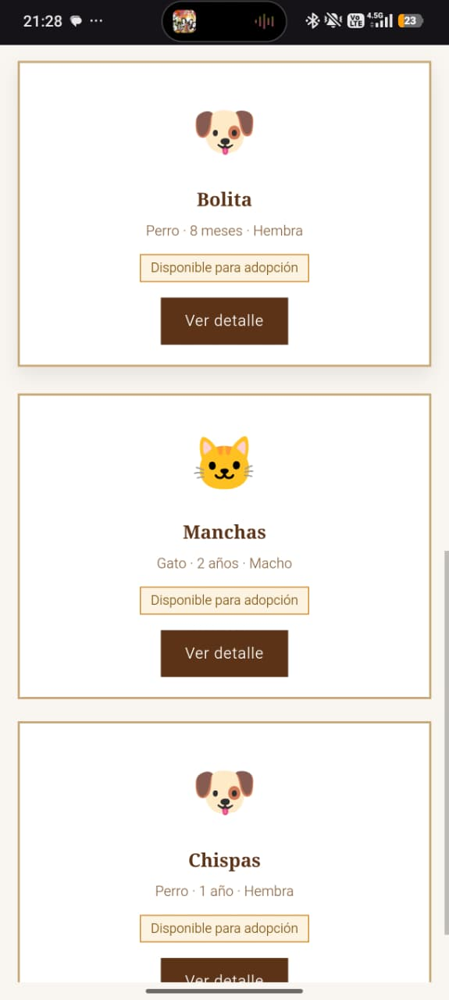 | 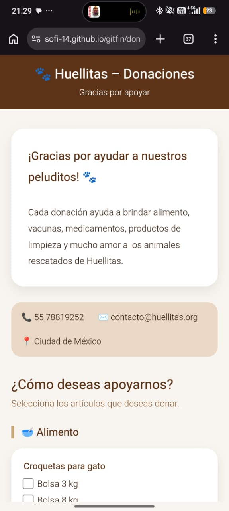 |
| 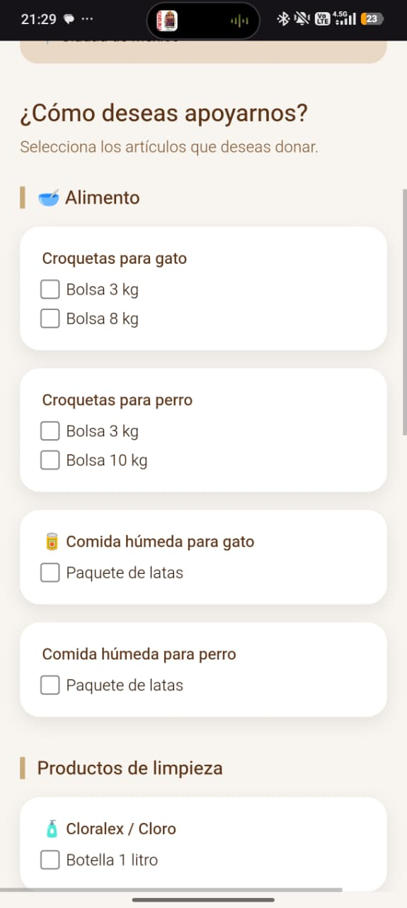 | 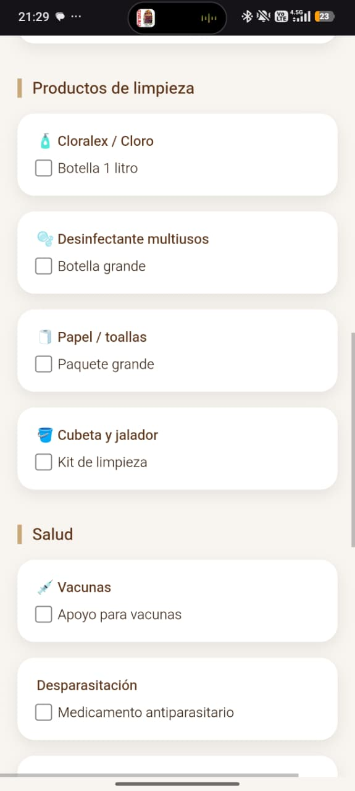 |
| 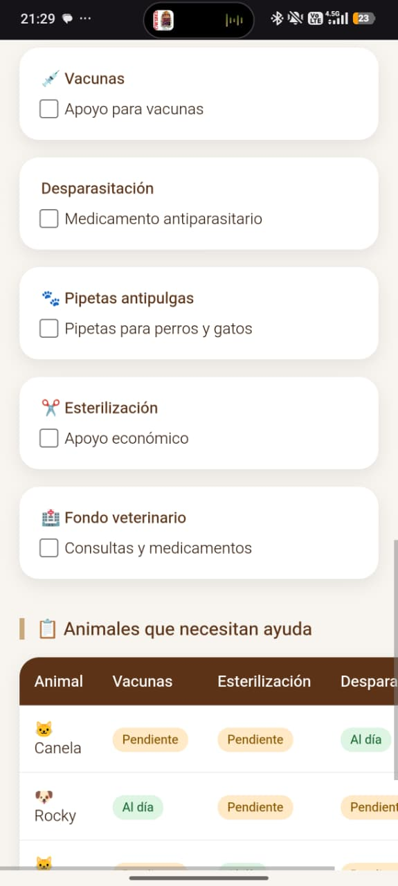 | 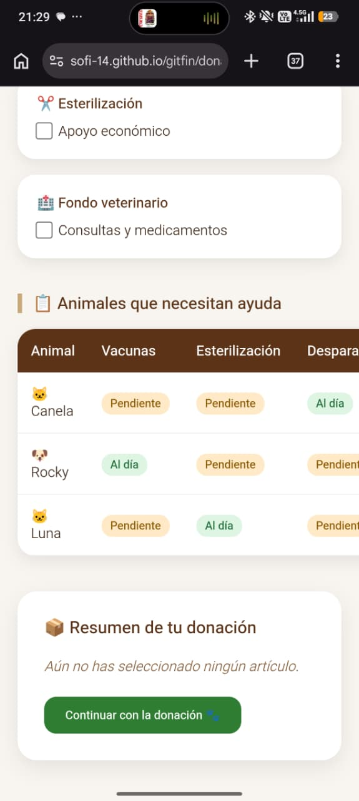 |
| 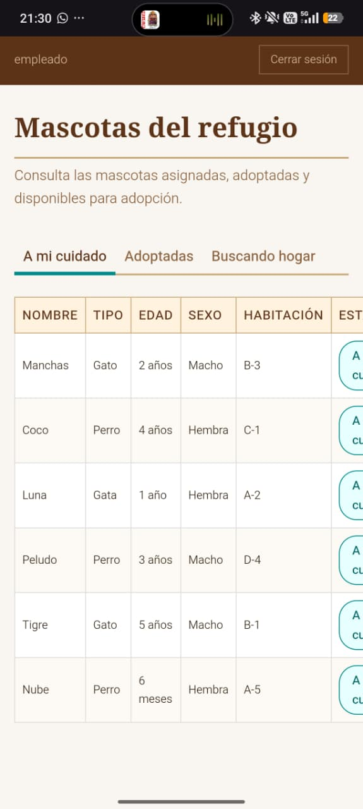 | 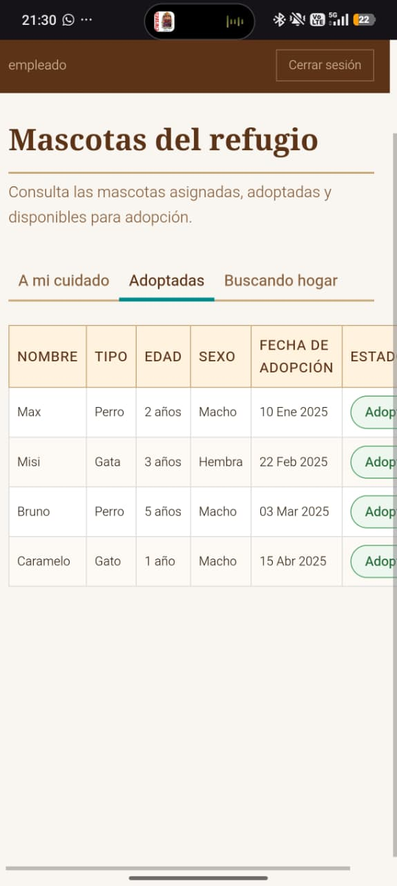 |
| 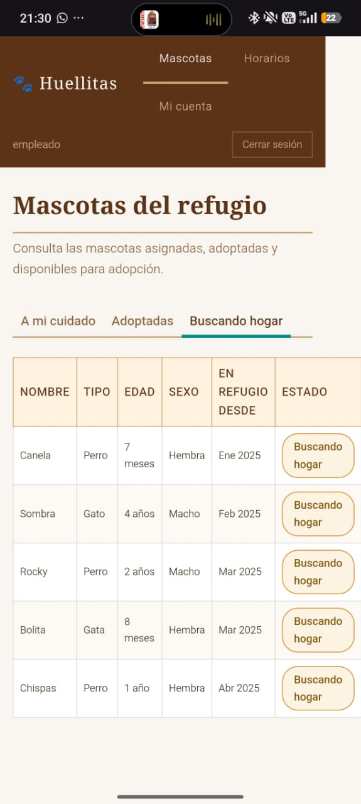 | 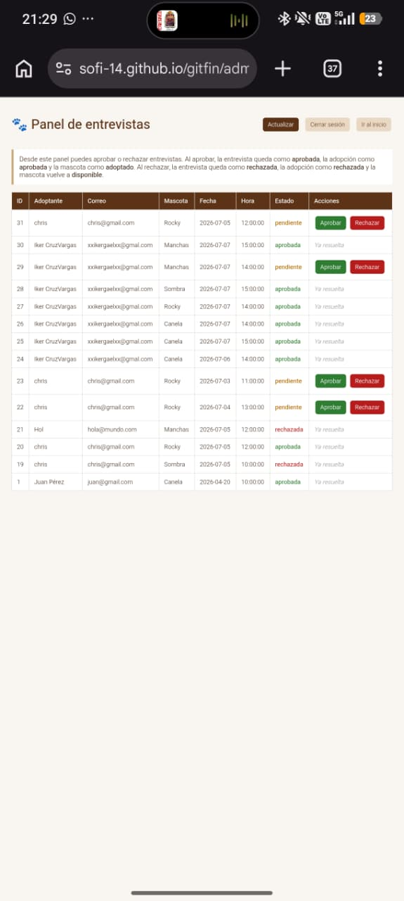 |
| 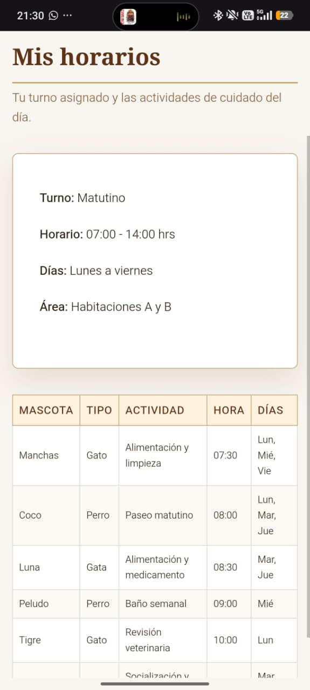 | 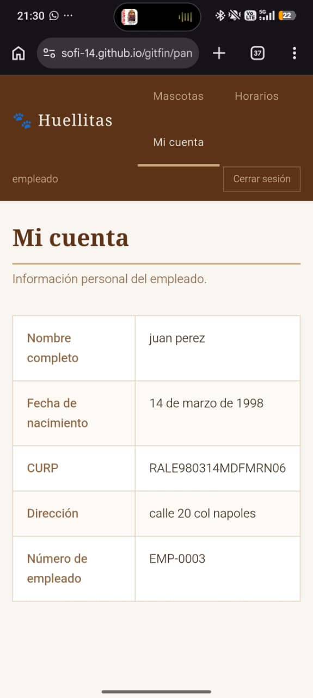 |


### Características principales

* Gestión de animales disponibles para adopción.
* Base de datos con información detallada de cada animal.
* Sistema de donaciones.
* Mejor presencia y difusión digital para la fundación.
* Interfaz amigable y accesible para los usuarios.

### 🔗 Enlaces
Código Fuente: [Repositorio](https://github.com/sofi-14/gitfin)
Página web: [PáginaWeb](https://sofi-14.github.io/gitfin/)